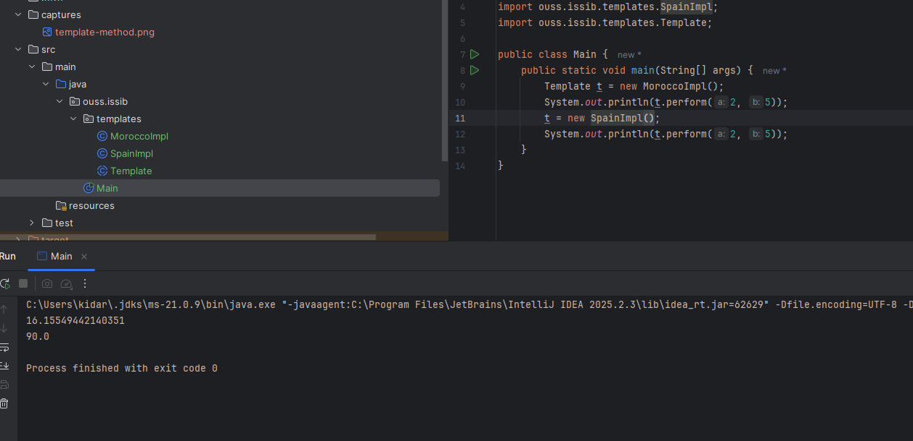

# 🧩 Activité Pratique – Implémentation du Design Pattern **Template Method** en Java

Ce dépôt présente une implémentation pratique du **Design Pattern Template Method** en Java. Cette activité fait partie du cours de **Design Patterns** encadré par **Mr YOUSSFI Mohamed**.

## 📘 Aperçu du projet

### Design Pattern Template Method
- **Objectif** : Illustrer l’utilisation du pattern **Template Method**, qui définit le squelette d’un algorithme dans une classe abstraite tout en laissant les sous-classes redéfinir certaines étapes spécifiques sans modifier la structure générale.
- **Technologies utilisées** :
  - `Java` (Programmation Orientée Objet)
  - Compatible avec tout IDE Java

## 🧱 Structure du projet

### 📦 Package `templates`
Contient la classe abstraite et ses implémentations :

- **Classe abstraite**  
  - `AbstractProcedure` → définit la méthode template `process()` et les étapes abstraites.

- **Implémentations**  
  - `MoroccoImpl` → implémentation spécifique au contexte marocain.  
  - `SpainImpl` → implémentation spécifique au contexte espagnol.

- **Classe de test**  
  - `Main` → lance l’exécution des procédures.

---

## ⚙️ Fonctionnalités principales
1. Mise en place d’un algorithme générique dans une classe abstraite.  
2. Possibilité de personnaliser les étapes via héritage.  
3. Application du principe Open/Closed (OCP).  
4. Standardisation et réduction du code dupliqué.

---

## 🧩 Diagramme du Pattern Template Method


---

## 🚀 Comment Exécuter
```bash
git clone https://github.com/ouss-issib/design-pattern-template-method-java.git
cd design-pattern-template-method-java
mvn clean install
mvn javafx:run
